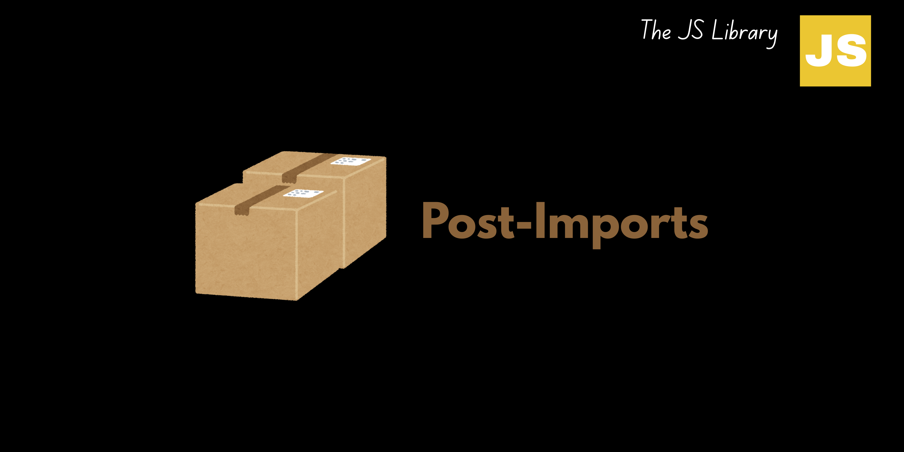

# Post Imports



**This Modules helps to ship with desired folder structure.**

```terminal
npm i -D post-imports
```

> [!NOTE]
>
> - This module only works after compilation that's why it use work in every framework of `.js` and `.ts`.
> - This is mainly use in **monorepo** projects.

## Explanation of each features

| Field   | Type   | Description                                                                                                        |
| ------- | ------ | ------------------------------------------------------------------------------------------------------------------ |
| root    | string | The root directory where the files are located.                                                                    |
| files   | string[] | A list of glob patterns representing the files to be considered for import changes.                                |
| copy    | CopyConfig[] | An array of objects, each specifying a file to copy (`from`) to a destination (`to`).                             |
| delete  | string[] | A list of glob patterns for files to exclude from import changes.                                                  |
| changes | ChangeConfig[] | An array of objects, each specifying an import path to change (`toChange`) and its original path (`toChangeFrom`). |
| ignore  | string[] | A list of glob patterns representing directories to exclude from import changes.                                    |
| file    | FileConfig[] | An array of objects, each specifying a single file with a `path`, and the import paths to change within that file. |

### CopyConfig Table

| Field | Type   | Description                              |
| ----- | ------ | ---------------------------------------- |
| from  | string | The path to the file to be copied.       |
| to    | string | The destination path to copy the file to.|

### ChangeConfig Table

| Field         | Type   | Description                              |
| ------------- | ------ | ---------------------------------------- |
| toChange      | string | The new import path to be used.          |
| toChangeFrom  | string | The original import path to be replaced. |

### FileConfig Table

| Field | Type   | Description                                                     |
| ----- | ------ | --------------------------------------------------------------- |
| path  | string | The path to the specific file where import changes are applied. |
| toChange      | string | The new import path to be used in the specified file.           |
| toChangeFrom  | string | The original import path to be replaced in the specified file.  |

### Each Operation Running Flow

1. Copy specified files.
2. Delete specified files.
3. Update import paths in priority files as per configuration.
4. Modify import paths in all specified files.

> Write your post structure according to this **Operation Running Flow**

## Example

You can write this in any file you want. by default, its configuration file is `package.json`.

```json
//! package.json
"postImports": {
    "root": "/project/src",
    "files": ["index.ts", "app.ts"],
    "copy": [
        { "from": "/project/src/assets", "to": "/project/dist/assets" }
    ],
    "delete": ["/project/src/temp"],
    "changes": [
        { "toChange": "oldFunction()", "toChangeFrom": "newFunction()" }
    ],
    "ignore": ["node_modules", "dist"],
    "file": [
        { "path": "/project/src/index.ts", "toChange": "require", "toChangeFrom": "import" }
    ]
}
```

```javascript
import postImports from postImports

postImports(); //configure file by default it's `package.json`

```

## License

This project is licensed under the MIT License.
[MIT](LICENSE)

